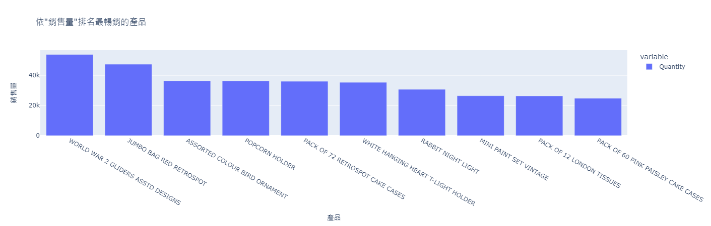

# 使用RFM模型進行客戶分群，並進行客戶價值分析

共有54萬筆資料，包含以下欄位：
* InvoiceNo: 訂單編號
* StockCode: 產品編號
* Description: 產品描述
* Quantity: 訂單數量
* InvoiceDate: 訂單日期
* UnitPrice: 產品單價
* CustomerID: 客戶編號
* Country: 國家

1. 英國營業額佔據84%，為英國的公司，並且內銷居多
1. 最有價值的客戶，只佔客戶總數10.7%，但貢獻了總銷售額的42.7%。銷售過度集中，建議重點開發常購買顧客，並提高客單價
1. 美國退貨率最高，超過一半，建議集中改善退貨產品品質

## 最暢銷的產品

## 交易額前十大客戶

## 退貨率最高的國家 - 美國

## 美國退貨數量最高的前十個產品

## RFM分析

## RFM網格圖

